# STUDYALONG CULTURESCHOOL

STUDYALONG CULTURESCHOOL is a fictional school located in a small town of Sweden. The app is a school management system designed to allow students and admin to easily manage the courses and bookings. It also provides users with a simple, easy to use booking system where they can view and manage their own bookings.
The live link can be found here: [Live Site - STUDYALONG CULTURESCHOOL](https://cultureschool-1a3ff85c7080.herokuapp.com/)

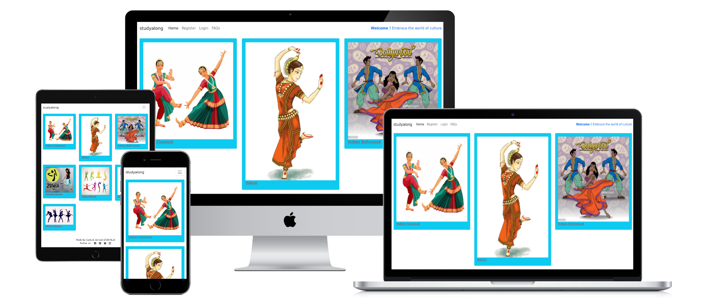


# User-Experience-Design

## The-Strategy-Plane

### Site-Goals

The site is aimed to help students and admin to easily manage courses and bookings in the website, as well as keeping track of existing bookings  editing and deleting as neccessary. 

The site also aims to provide informations to visitors abouth the courses , the places left for a course and the detailed information about date , place etc. 

### Agile Planning

This project was developed using agile methodologies by delivering small features.

All projects were assigned to epics, prioritized under the labels, Must have, should have, nice to have. "Must have" stories were completed first, "should haves" and then finally "nice to haves". It was done this way to ensure that all core requirements were completed first to give the project a complete feel, with the nice to have features being added should there be capacity.

The Kanban board was created using github projects and can be located [here](https://github.com/users/Rupa830904/projects/6) and can be viewed to see more information on the project cards. All stories except the documentation tasks have a full set of acceptance criteria in order to define the functionality that marks that story as complete.

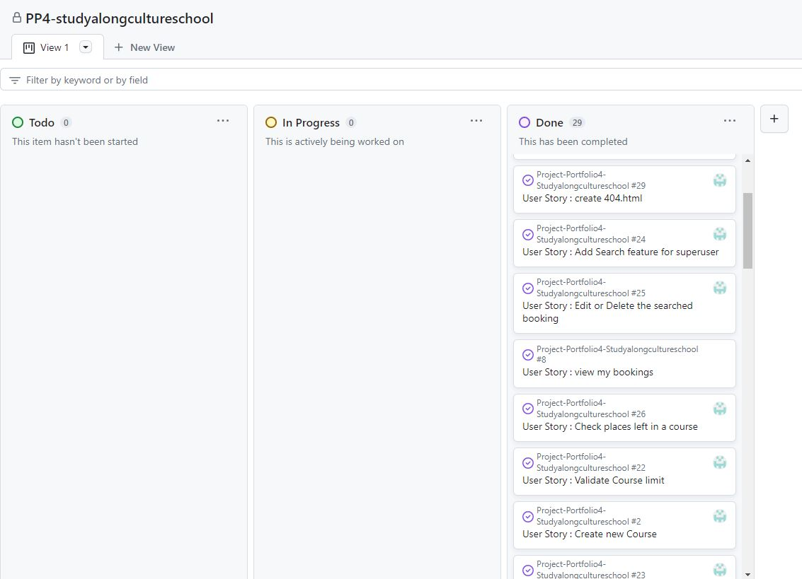

#### Epics

The project had 8 main Epics (milestones):

**EPIC 1 - Base Setup**

The base setup epic is for all stories needed for the base set up of the application. Without the base setup, the app would not be possible so it was the first epic to be delivered as all other features depend on the completion of the base setup.

**EPIC 2 - Stand alone Pages**

The stand alone pages epic is for small pages that did not have enough stories to warrant their own full epics. Instead of creating epics for tiny features, these small deliverables were all added under this epic.


**EPIC 3 - Course**

The course epic is for all stories that relate to the creating, editing and viewing of courses. This allows for regular users to view menus and for admin to manage them with a simple UI interface.

**EPIC 4 - Booking**

The booking epic is for all stories that relate to creating, viewing, updating and deleting bookings. This allows the users to easily view upcoming bookings, manage the bookings and also for users to book and manage their course bookings. This also allows admin to find any booking for all users and edit or delete if necessary.

**EPIC 5 - FAQ**

The FAQ epic is for all stories that relate to creating, viewing, updating frequently asked questions. This allows the users to easily ask questions and admins to answer them.

**EPIC 6 - Validation**

The validation epic is for all stories that checks the user inputs for creating any booking against the rules of the culture school.his allows the school to adhere to booking policies.

**EPIC 7 - Authentication**

This epic is for all stories that relate to app authentication. Like create sign in and login features.

**EPIC 8 - Documentation**

This epic is for all document related stories and tasks that are needed to document the software development lifecycle of the application. It aims to deliver quality documentation, explaining all stages of development and necessary information on running, deploying and using the application.

Tasks:

* Complete readme documentation
* Write unti test cases
* Complete testing documentation write up

#### User Stories

**EPIC 1 - Base Setup**

As a developer, I need to create the navbar so that users can navigate the website from any device.

As a developer, I need to create the base.html page and structure so that other pages can reuse the layout.

As a developer, I need to set up the project so that it is ready for implementing the core features.

As a developer I can deploy the base project to heroku so that **I can complete the initial set up with all components Postgres DB , Clodinary ,Github and Heroku.


**EPIC 2 - Stand alone Pages**

As a developer, I should create 404.html so that if the user is prompted with a redirect message when landed on a non-existent page.

As a developer, I should create 403.html so that unauthorised user access geta 'Access Forbodden'.

As a developer I need to create 500.html so that users gets an option to redirect in case of internal server errors.

**EPIC 3 - Course**

As a site user I can read the details os a course so that I can choose to book.

As a Superuser I can create new courses so that I can manage my school courses.

As a superuser I can edit course details so that I can update date, place,teacher and content.

As a user I can check the places left in a course so that I can choose the course to join

**EPIC 4 - Booking**

As a site user I can view my bookings so that I can manage my bookings.

As a site user I can book a course so that I can join the school.

As a Site User I can Delete my booking so that I can unregister from a course.

As a user I can edit my bookings so that I can manage the bookings.

As a user I get the confirmation messages for booking operations so that I know the operation is successful.

As a superuser I can search a booking with Full name so that I can see the bookings detail.

As a superuser I can EDIT or DELETE the booking after I search and find the booking so that I can change the booking is necessary.

**EPIC 5 - FAQ**

As a userr I can ask question to culture school ** so that I get more details about the school.

As a user I can read the FAQ with or without login so that I know about culture school.

As a superuser I can answer question in FAQ page so that I can reply to user queries.

**EPIC 6 - Validation**

As a developer I need to validate the age for new registration so that minimum 5 years of age limit is maintained in school.

As a developer I need to validate free place in course so that user gets message when course is full. Maximum place in course is 10.

As a developer I must validate the new booking against the existing booking so that double booking is prevented.


**EPIC 7 - Authentication**

As a Site User I can sign up to culture school so that I can book courses*.

As a user I can login to teh app so that I can use the features.

**EPIC 8 - Documentation**

As a developer I write testing.md so that all the testing carried on is well explained.

As a developer, I write readme.md so that all the whole project is well explained.


## The-Scope-Plane

* Responsive Design - Site should be fully functional on all devices from 320px up
* Ability to perform CRUD functionality on Menus and Bookings
* Restricted role based features for regular users and admins
* Home page with courses information


### Features

``USER STORY - As a developer, I need to create the navbar so that users can navigate the website from any device``

Implementation:

**Navigation Menu**

The Navigation contains links for Home, Bookings, FAQs and has allauth options.

The navigation option is displayed on all pages . This will allow users to view the site from any device and not take up too much space on mobile devices.

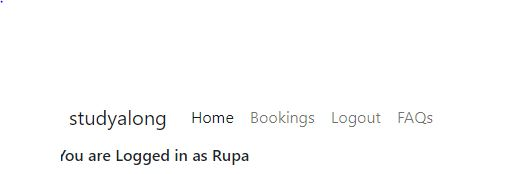

``USER STORY - As a site user I can read the details os a course so that I can choose to book``

Implementation:

**Course Page**

The course page contains a imahge and the title of the available courses. It also provides a link below each course title. On use click it opens a new page with course details.

Under the information section are two buttons, 'Make a booking' and 'View Menus'. These buttons will allow the user a quick way to the respective pages if they wish to make a booking or view the restaurants active menus.

The last section of the home page contains a google map, marking the location of the restaurant and the opening hours of the restaurant. This will allow the user to locate the restaurant and operating times.

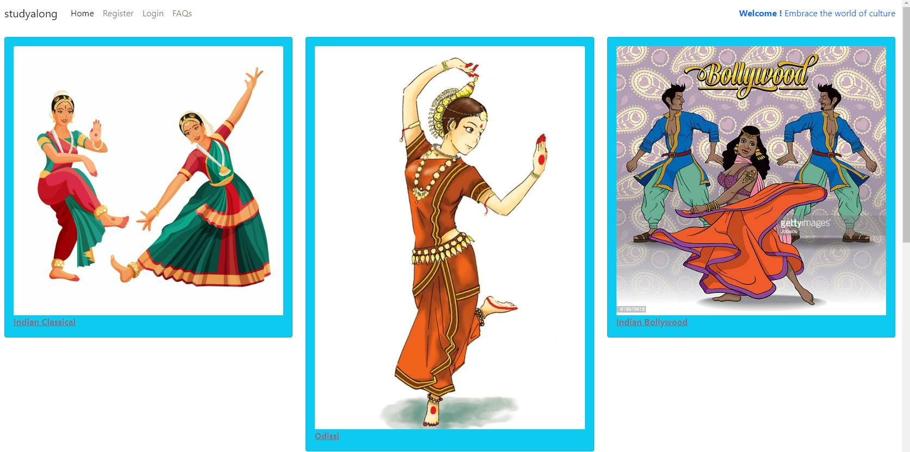

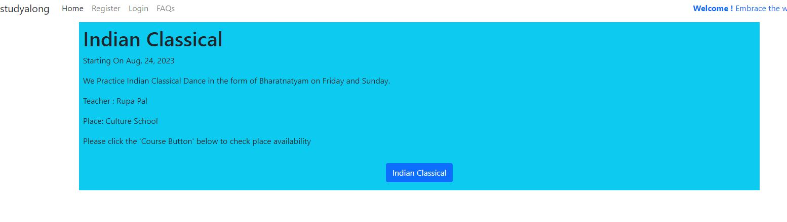


``USER STORY - As a superuser I can edit course details so that I can update date, place,teacher and content``

**Edit Course**

Implementation:
 
A superuser will get am EDIT button on course detail page. the button will redirect to the course form where Place , Teacher , Description and Course start date can be edited.

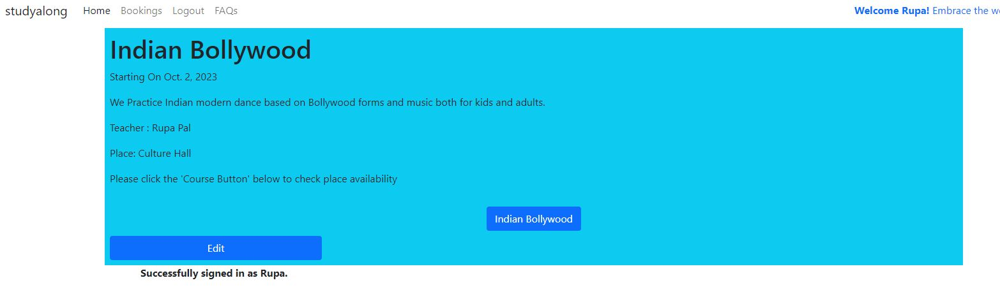

``USER STORY - As a Superuser I can create new courses so that I can manage my school courses``

**Create New Course**

Implementation:

A create course button was implemented to allow teh super user to create new course. It allows to populate all attributes of the course.

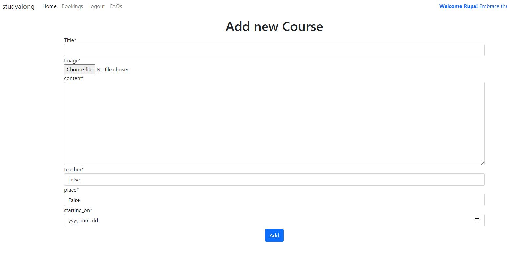


``USER STORY -As a user I can check the places left in a course so that I can choose the course to join``

**Check Course Availability**

Implementation:

A button has been implemented in each course details page. On click it will display the places left to the user.

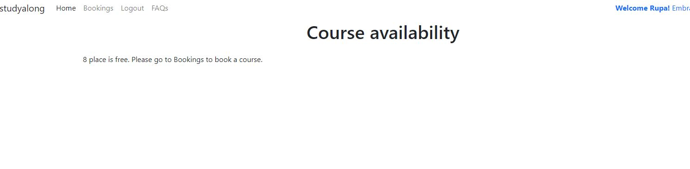

``USER-STORY - As a site user I can book a course so that I can join the school``

Implementation:

**Create booking page**

A 'Book a Course' button was created on booking page. It opens the booking form. On submit the filled up booking form , the course is booked if all school rules are adhered.

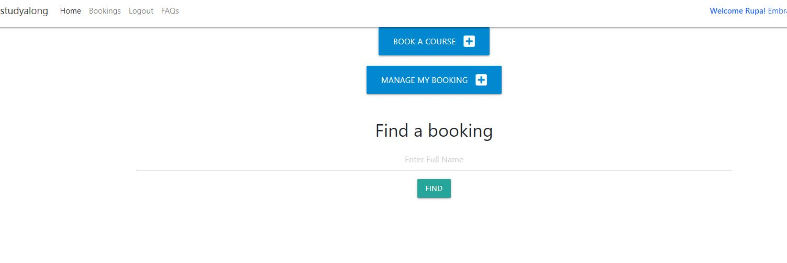

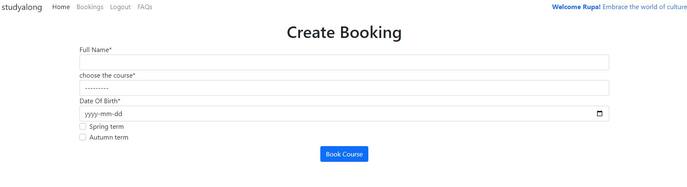

``USER-STORY - As a user I can edit my bookings so that I can manage the bookings``

Implementation:

**Manage bookings page**

A manage my bookings button was implemented, On clicking this button , It displays all the bookings of the user. User has options to edit or delete the existing bookings.

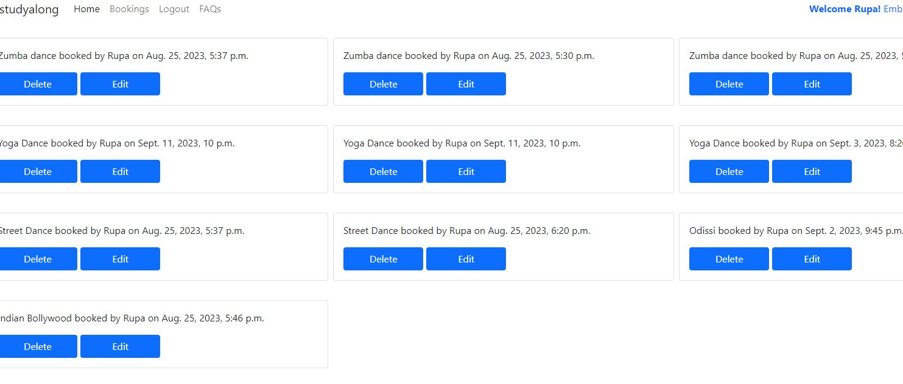

``USER-STORY - As a As a user I get the confirmation messages for booking operations so that I know the operation is successf``

Implementation:

**Booking operation success**

On every successful operation, a user message is displayed whether the operation is successful or user is advised with the school rules.

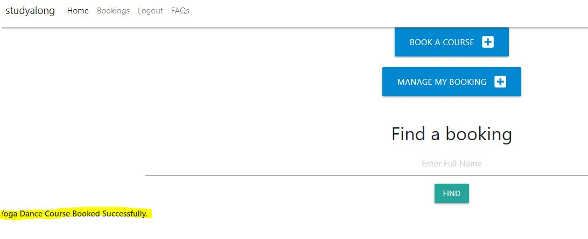

``USER-STORY - As a superuser I can search a booking with Full name so that I can see the bookings details``

Implementation:

**Search a Booking**

A serach box is available for superuser to search any bookings. After entering the Full Name and click on Find , the booking details is diaplayed eith EDIT/DELETE option.


``USER-STORY - As a superuser I can EDIT or DELETE the booking after I search and find the booking so that I can change the booking is necessary``

Implementation:

**Manage searched booking**

After the finding a booking from search, a superuser can edit or delete the booking as necessary same as manage my booking page.

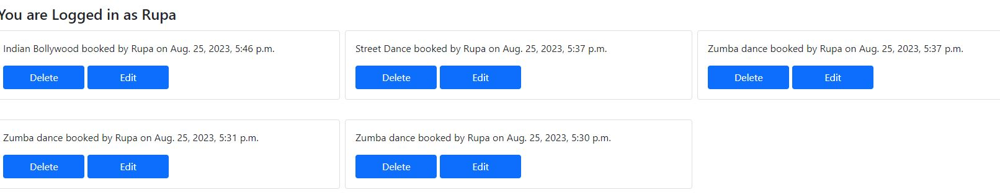


``USER-STORY - As a Site User I can Delete my booking so that I can unregister from a course.``

Implementation:

**Delete Booking**

A delete button was added to the each booking. A user can delete his/her own booking.Additional user confirmation page is displayed as well.

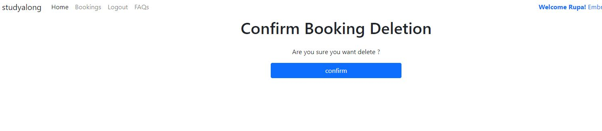

``USER-STORY - As a user I can read the FAQ with or without login so that I know about culture school.``

Implementation:

**Read FAQ**

A user can navigate to the 'FAQ' tab and read all Q & A without login.

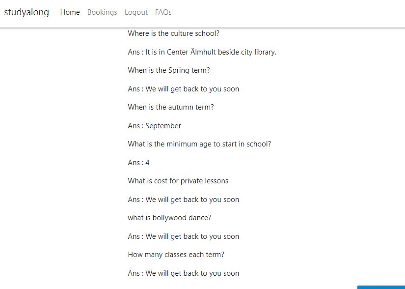

``USER-STORY - As a user I can ask question to culture school  so that I get more details about the school``

**Ask FAQ**

A user button implemented to open a form to post question to culture school.

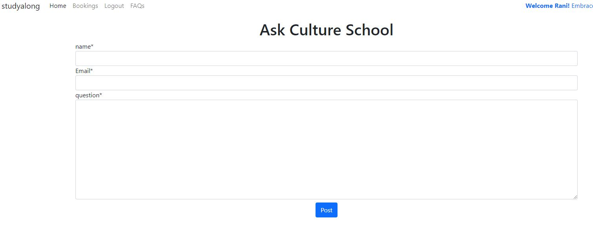

``USER-STORY - As a superuser I can answer question in FAQ page so that **I can reply to user queries **``

**Answer FAQ**

A user button implemented for superuser to answer any questiones posted in faq page.

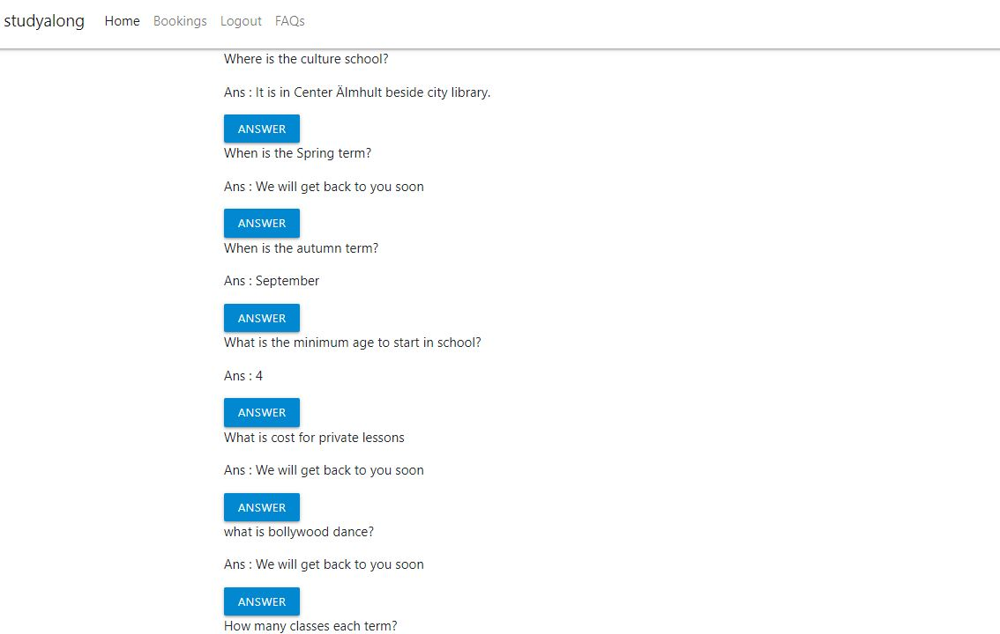


**Validate booking User Stories**

The following stories were implemented in order to validate the user request to book a course.

``As a developer I need to validate the age for new registration so that minimum 5 years of age limit is maintained in school``

``As a developer I need to validate free place in course so that user gets message when course is full. Maximum place in course is 10.``

``As a developer I must validate the new booking against the existing booking so that double booking is prevented``

``As a user I can only delete my bookings so that it protects any accidental delete.``

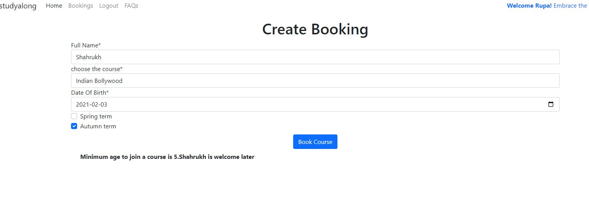

**Error Pages**

``USER STORY - As a developer, I need to implement a 404 error page to alert users when they have accessed a page that doesn't exist``

Implementation:

**404 Page**

A 404 page has been implemented and will display if a user navigates to a broken link.

The 404 page will allow the user to easily navigate back to the main website if they direct to a broken link / missing page, without the need  of the browsers back button.

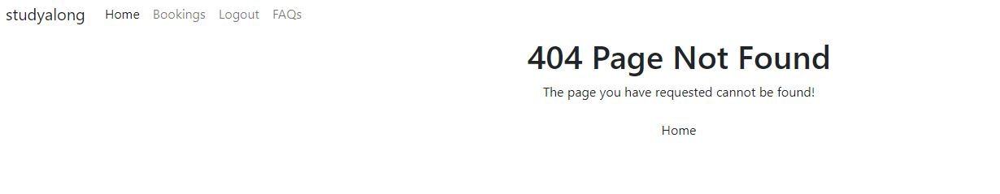

``USER STORY - As a developer, I need to implement a 403 error page to alert users when accessing a page/view that they do not have permission to view``

Implementation:

**403 Page**

A 403 error page has been implemented to provide feedback to the user when they try to access unauthorized content. Users will be directed to this page if they alter the URL's and attempt to edit, delete or access pages that are restricted. 


``USER STORY - As a developer I need to create 500.html so that users gets an option to redirect in case of internal server errors.``

Implementation:

**500 Page**

A 500 error page has been displayed to alert users when an internal server error occurs. The message relays to users that the problem is on our end, not theirs.

**Authentication Stories**

The following stories were implemented in order to set up sign in and authentication method to the app.To use all features of the app like booking all users needs to register and login. User can navigate to register to sign in and can navigate to login to login to the application.

``USER STORY -- As a Site User I can sign up to culture school so that I can book courses ``

``USER STORY -- As a user I can login to the app so that I can use the features. ``


**Base Setup User Stories**

The following stories were implemented in order to set up a base structure for all the HTML pages and the core installations and configurations needed to run the application. While these do not show as individual features, they were stories completed that were needed to implement all of the stories above.

``USER STORY - As a developer I can deploy the base project to heroku so that **I can complete the initial set up with all components( Postgres DB , Clodinary ,Github and Heroku. **``

``USER STORY - As a developer, I need to set up the project so that it is ready for implementing the core features``

``USER STORY - As a developer, I need to create the base.html page and structure so that other pages can reuse the layout ``


### Database-Design

The database was designed to allow CRUD functionality to be available to registered users, when signed in. The course model is at the heart of the application as it is connected the Bookcourse model, linked by primary/foreign key relationships.The FAQ model is a standalone model providing the Q&A feature to the visitors.

Bookings are related to the course by a Foreign Key which allows the users to manage bookings attached to their accounts.


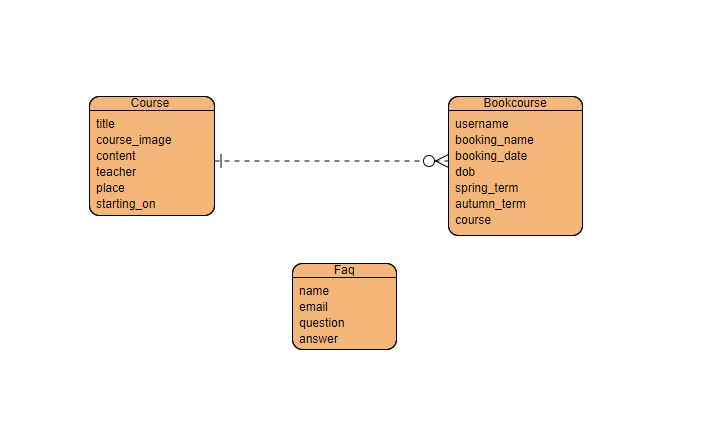

### Security

Views were secured by using the django class based view mixin, UserPassesTextMixin. A test function was created to use the mixin and checks were ran to ensure that the user who is trying to access the page is authorized. Any restricted functionality, user edit/delete functionality listed in the features was secured using this method.

Environment variables were stored in an env.py for local development for security purposes to ensure no secret keys, api keys or sensitive information was added the the repository. In production, these variables were added to the heroku config vars within the project.

## The-Surface-Plane

### Imagery

The course images were taken from google.com copyright free images.


## Technolgies

- HTML
  - The structure of the Website was developed using HTML as the main language.
- CSS
  - The Website was styled using custom CSS in an external file.
- Python
  - Python was the main programming language used for the application using the Django Framework.
- Visual Studio Code
  - The website was developed using Visual Studio Code IDE
- GitHub
  - Source code is hosted on GitHub
- Git
  - Used to commit and push code during the development of the Website
- Font Awesome
  - This was used for various icons throughout the site
- Canva
  - This was used to create the logo in header 

**Python Modules Used**

* Django Class based views (ListView, UpdateView, DeleteView, , DetailView) - Used for the classes to create, read, update and delete
* Mixins (LoginRequiredMixin, UserPassesTestMixin) - Used to enforce login required on views and test user is authorized to perform actions
* messages - Used to pass messages to the toasts to display feedback to the user upon actions
* date - Date was used in order to search for objects by date

**External Python Modules**

* asgiref==3.7.2 - Allows to wrap a WSGI application so it appears as a valid ASGI application.
* cloudinary==1.33.0 - Cloundinary was set up for use but no custom uploads were made, settings remain for future development
* crispy-bootstrap4==2022.1- This was used to allow bootstrap5 use with crispy forms
* dj-database-url==0.5.0 - Used to parse database url for production environment
* dj3-cloudinary-storage==0.0.6 - Storage system to work with cloudinary
* Django==3.2.20 - Framework used to build the application
* django-allauth==0.54.0 - Used for the sites authentication system, sign up, sign in, logout, password resets ect.
* django-crispy-forms==2.0 - Used to style the forms on render
* gunicorn==21.2.0 - Installed as dependency with another package
* oauthlib==3.2.2 - Installed as dependency with another package
* psycopg2==2.9.6 - Needed for heroku deployment
* PyJWT==2.4.0 - Installed as dependency with another package
* python3-openid==3.2.0 - Installed as dependency with another
* pytz==2023.3 -  This library allows accurate and cross platform timezone calculations
* requests-oauthlib==1.3.1 -Installed as dependency with another
* sqlparse==0.4.4 - Installed as dependency with another package

## Testing

Test cases and results can be found in the [TESTING.md](testing.md) file. 

## Deployment

### Version Control

The site was created using the Visual Studio Code editor and pushed to github to the remote repository ‘Gars-Steakhouse’.

The following git commands were used throughout development to push code to the remote repo:

```git add <file>``` - This command was used to add the file(s) to the staging area before they are committed.

```git commit -m “commit message”``` - This command was used to commit changes to the local repository queue ready for the final step.

```git push``` - This command was used to push all committed code to the remote repository on github.

### Heroku Deployment

The site was deployed to Heroku. The steps to deploy are as follows:

- Navigate to heroku and create an account
- Click the new button in the top right corner
- Select create new app
- Enter app name
- Select region and click create app
- Click the resources tab and search for Heroku Postgres
- Select hobby dev and continue
- Go to the settings tab and then click reveal config vars
- Add the following config vars:
  - SECRET_KEY: (Your secret key)
  - DATABASE_URL: (This should already exist with add on of postgres)
  - CLOUNDINARY_URL: (cloudinary api url)
- Click the deploy tab
- Scroll down to Connect to GitHub and sign in / authorize when prompted
- In the search box, find the repositoy you want to deploy and click connect
- Scroll down to Manual deploy and choose the main branch
- Click deploy

The app should now be deployed.

The live link can be found here: [Live Site](https://cultureschool-1a3ff85c7080.herokuapp.com/)

### Run Locally

Navigate to the GitHub Repository you want to clone to use locally:

- Click on the code drop down button
- Click on HTTPS
- Copy the repository link to the clipboard
- Open your IDE of choice (git must be installed for the next steps)
- Type git clone copied-git-url into the IDE terminal

The project will now have been cloned on your local machine for use.

### Fork Project

Most commonly, forks are used to either propose changes to someone else's project or to use someone else's project as a starting point for your own idea.

- Navigate to the GitHub Repository you want to fork.

- On the top right of the page under the header, click the fork button.

- This will create a duplicate of the full project in your GitHub Repository.

## Credits 

[Django docementation](https://docs.djangoproject.com/en/4.2/) helped to learn class based views and the usage of python modules.

My mentor Gareth Mcgirr helped  with guidance, materials and advises throughout the project.