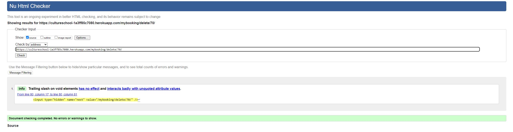

## Functional Testing

**Authentication**

Description:

Ensure a user can sign up to the website

Steps:

1. Navigate to [Home page](https://cultureschool-1a3ff85c7080.herokuapp.com/) and click Register
2. Enter email, username and password 
3. Click Sign up

Expected:

Login completed and Home page is displayed. Home page displaying login user.

Actual: 

Login completed and Home page is displayed.Home page displaying login user.

Description:

Ensure a user can log in once signed up

Steps:
1. Navigate to [Home page](https://cultureschool-1a3ff85c7080.herokuapp.com/) and Login Page
2. Enter login details. Created in previous test case
3. Click login

Expected:

User is successfully logged in and redirected to the home page.All pages displaying login user.

Actual:

User is successfully logged in and redirected to the home page. All pages displaying login user.

Description:

Ensure a user can sign out

Steps:

1. Login to the website
2. Click the logout button
3. Click confirm on the confirm logout page

Expected:

User is logged out

Actual:

User is logged out

**Booking Forms**

Description:

Ensure a new booking can be created.

Steps:

1. Navigate to 'Bookings' - Login if prompted.
2. Click on 'Book a Course'.
3. Enter the following:
    - Name: Rupa pal
    - Choose the course: Choos a course from drop down
    - Date: Date of Birth
    - Term: Check the box as applicaböe
4. Click Create

Expected:

Form successfully submits and a message displays to user to confirm  the user of successful booking.

Actual:

Form successfully submits and a message displays to user to confirm  the user of successful booking.

 

Description:

Ensure a booking can be edited.

Steps:

1. Navigate to Manage My booking - Login if prompted.
2. All bookings done by the logged in user is didplayed.
3. Click on the edit 
4. Edit the booking details as necessary.
5. Click Confirm

Expected:

Form successfully submits and a message displays to user to confirm  the user of successful booking edit.

Actual:

Form successfully submits and a message displays to user to confirm  the user of successful booking edit.

Description:

Ensure user can successfully delete a booking.

Steps:
1. Navigate to Manage My booking - Login if prompted.
2. All bookings done by the logged in user is displayed.
3. Click on the Delete.
4. Click Confirm

Expected:

Booking is successfully deleted and a message displays to user to confirm  the user of successful deletion.

Actual:

Booking is successfully deleted and a message displays to user to confirm  the user of successful deletion.

Description:

Ensure a booking can be searched by super user..

Steps:

1. Login as superuser and navigate to booking page.
2. Provide the 'Full name' in the search panel 'Find a Booking'.
3. Click on Find.

Expected:

All bookings of that name is displayed with EDIT and DELETE button.

Actual:

All bookings of that name is displayed with EDIT and DELETE button.

**Course Pages**

Description:

Ensure Course details is available to users.

Steps:

1. Home page opens as the app home page ans the courses are displayed.
2. Click on the link below the course name for each course.
3. Detail course information displayed.

Expected:

On click to detail link , details (description, start date, details , teacher etc. is displayed)

Actual:

On click to detail link , details (description, start date, details , teacher etc. is displayed)

Description:

Ensure a new course can be created

Steps:

1. Login as superuser.
2. Click on the 'create course' button below the page.
3. Enter the follow details:
    - Title: Course Title
    - image: Course image
    - content: Course description
    - teacher: CCourse teacher
    - place: place
    - starting_on: start date
4. Click Add

Expected:

A new course is created and displayed on the Home page.

Actual:

A new course is created and displayed on the Home page.

Description:

Ensure a course can be updated

Steps:

1. Sign in as a superuser
2. Click on the link to view course detail.
3. Clink on the Edit button
4. Edit one or more field as necessary
    - content: Course description
    - teacher: CCourse teacher
    - place: place
    - starting_on: start date
5. Click on confirm.

Expected:

Course details has been updated and shown on the detail page.

Actual: 

Course details has been updated and shown on the detail page.

Description:

Ensure a user can view the places left in a course.
Steps:

1. Navigate to Course detail page.
2. Click on the 'course' button below the page - Login if prompted
3. A message is displayed with places left.

Expected:

On click the course button on 'course detail' page , a message is displayed with places left.

Actual:

On click the course button on 'course detail' page , a message is displayed with places left.

**FAQ Pages**

Description:

Ensure FAQ page is available to users.

Steps:

1. Navigate to the FAQ page.
2. User should be able to read all Q & A.

Expected:

On FAQ page , user is able to read all the Q & A.
Actual:

On FAQ page , user is able to read all the Q & A.

Description:

Ensure a user can ask question to culture school in FAQ page.

Steps:

1. Navigate to the FAQ page.
2. Click on the 'Ask culture School' button below the page.
3. Fill up the below form.
    - Name
    - Email
    - Question
4. Click on the Post button.

Expected:

User is able to post question and the question is visible in FAQ page.

Actual:

User is able to post question and the question is visible in FAQ page.

Description:

Ensure a super can answer question to culture school in FAQ page.

Steps:

1. Navigate to the FAQ page. -- Login as superuser
2. Click on the 'Answer' button below every question.
3. Update the answer
4. Click Submit.

Expected:

Answer is updated and displayed in the FAQ page.

Actual:

Answer is updated and displayed in the FAQ page.

**Navigation Links**

Testing was performed to ensure all navigation links on the respective pages, navigated to the correct pages as per design. This was done by clicking on the navigation links on each page.

- Home -> index.html
- Bookings , Manage Bookings -> booking.html
- New Booking -> create_booking.html
- Edit Booking -> edit_booking.html
- Delete Booking -> booking_detail.html , booking_confirm_delete.html
- Find Booking -> search_booking.html
- FAQ = > faq.html
- Answer FAQ = > answer_faq.html
- Ask FAQ = > create_faq.html
- Logout -> Sign out all auth page
- Login -> Sign in all auth page
- Register -> Sign up all auth page

All navigation links directed to the corect pages as expected.

## Negative Testing

Tests were performed on the create booking to ensure that:

1. A user cannot book a the same course if already booked.
2. A user cannot book a course if younger than 5 years. (Minimum age to join a course is 5 years)
3. A cannot book a course if it is full. Maximum booking is 10.
4. Forms cannot be submitted when required fields are empty.

## Unit Testing

Unit tests were created to test some basic functionality such as templates used and redirects. These can be found in the tests.py files in the respective apps.

Results:

## Accessibility

[Wave Accessibility](https://wave.webaim.org/) tool was used throughout development and for final testing of the deployed website to check for any aid accessibility testing.

Testing was focused to ensure the following criteria were met:

- All forms have associated labels or aria-labels so that this is read out on a screen reader to users who tab to form inputs
- Color contrasts meet a minimum ratio as specified in [WCAG 2.1 Contrast Guidelines](https://www.w3.org/WAI/WCAG21/Understanding/contrast-minimum.html)
- Heading levels are not missed or skipped to ensure the importance of content is relayed correctly to the end user
- All content is contained within landmarks to ensure ease of use for assistive technology, allowing the user to navigate by page regions
- All not textual content had alternative text or titles so descriptions are read out to screen readers
- HTML page lang attribute has been set
- Aria properties have been implemented correctly
- WCAG 2.1 Coding best practices being followed

## Validator Testing

All pages were run through the [w3 HTML Validator](https://validator.w3.org/). Initially there were some errors due to stray script tags, misuse of headings within spans and some unclosed elements. All of these issues were corrected and all pages passed validation.

To test the validation on the files, open the page to validate, right click and view page source. Paste the raw html code into the validator as this will be only the HTML rendered code.More evidences added for each page validation under docs/testing_images folder.

All pages were run through the pycodestyle validator , to ensure all code was pep8 compliant. Some errors were shown due to blank spacing and lines too long, 1 line instead of 2 expected. All of these errors were resolved and code passed through pycodestyle check with the exception of the settings.py file.

## Responsiveness

All pages were tested to ensure responsiveness on screen sizes from 320px and upwards as defined in WCAG 2.1 Reflow criteria for responsive design on Chrome and Edge.

Steps to test:

- Open browser and navigate to [https://cultureschool-1a3ff85c7080.herokuapp.com/]
- Open the developer tools (right click and inspect)
- Set to responsive and decrease width to 320px
- Set the zoom to 50%
-  Click and drag the responsive window to maximum width

Expected:

Website is responsive on all screen sizes and no images are pixelated or stretched. No horizontal scroll is present. No elements overlap.

Actual:

Website behaved as expected.

Website was also opened on the following devices and no responsive issues were seen:

## Bugs

There are logout and sign in messages displayed while logging out and logging in. Identified the root cause to clear the django contrib messages. It was not possible to fix with the delivery timeline. it can be fixed in a bug fix release.
